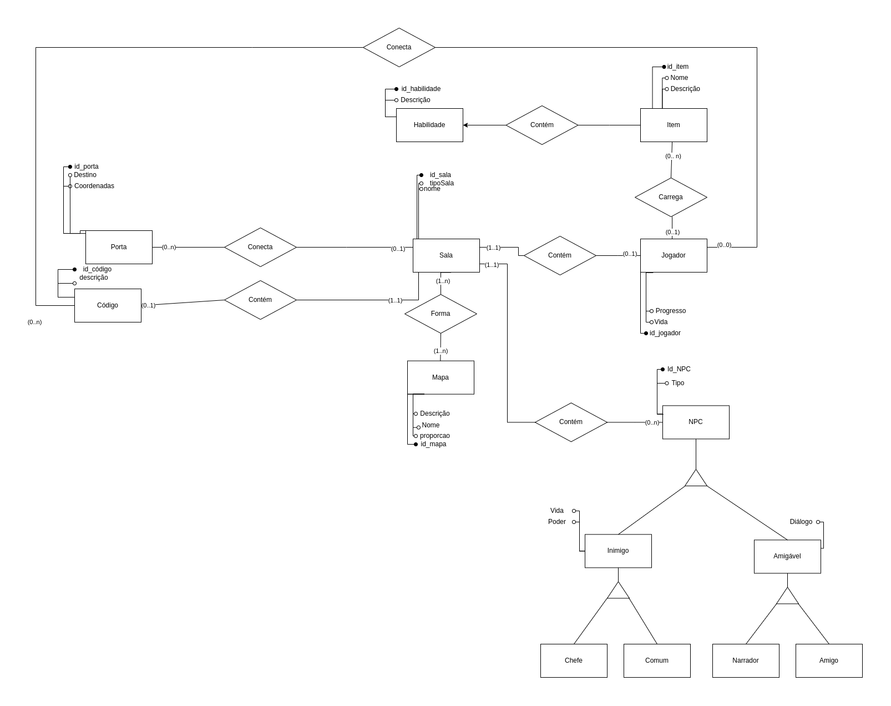

# DER - Diagrama Entidade Relacionamento

O Diagrama Entidade Relacionamento (DER) é uma ferramenta utilizada na modelagem de bancos de dados e possui o objetivo de abstrair do mundo real entidades, "coisas" que possuem carater semelhante, e os relacionamentos entre elas.

## Diagrama

  

## Histórico de Versões

| Data       | Versão | Descrição                             | Autor                |
| ---------- | ------ | ------------------------------------- | -------------------- |
| 28/11/2022 | `1.0`  | Desenvolvida a primeira versão do DER | Todos os integrantes |