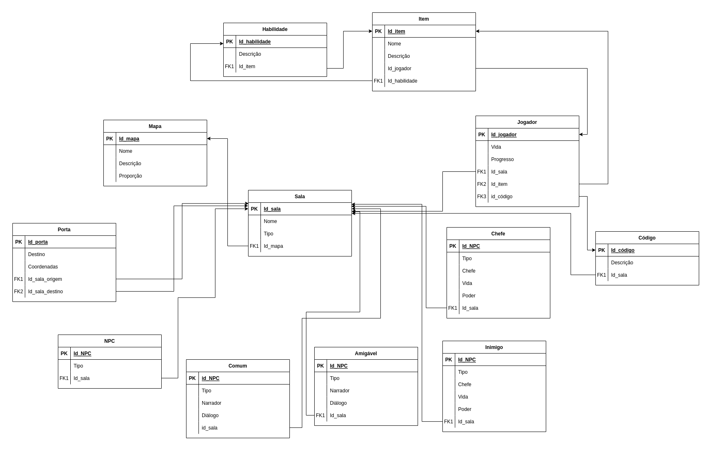

# MREL - Model Relacional

O modelo relacional é um modelo de dados representativos, adequado a ser o modelo subjacente de um Sistema Gerenciador de Banco de Dados(SGBD), que se baseia no princípio em que todos os dados estão guardados em tabelas. Toda sua definição é teórica e baseada na lógica de predicados e na teoria dos conjuntos.

## Diagrama

  

## Histórico de Versões

| Data       | Versão | Descrição                              | Autor                |
| ---------- | ------ | -------------------------------------- | -------------------- |
| 28/11/2022 | `1.0`  | Desenvolvida a primeira versão do MREL | Todos os integrantes |
